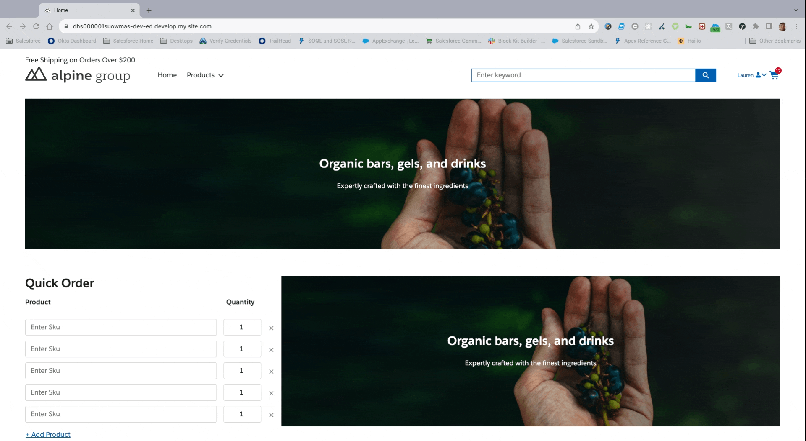

# Swatches

This component is a full capable swatch component for the Category & Product page that will allow you to visually view the colors of a product. 

### Installation Steps
1. Deploy Code to your instance
2. Navigate to the Category Page & Product Page in Experience Builder
3. Drag the respective components under the custom component section to the top right of the right column on category & product page.
4. Publish Site
5. Login as user and check components values for accuracy

